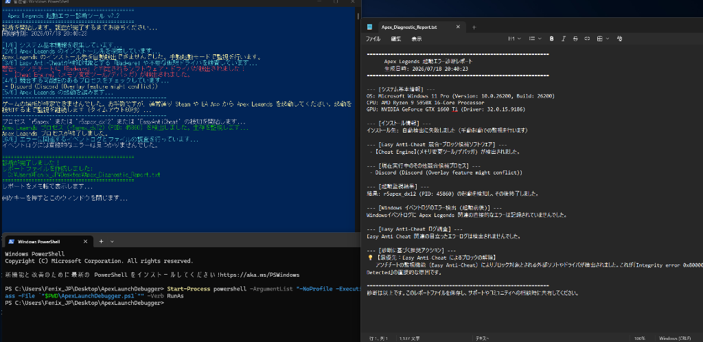

# Apex Legends Launch Debugger

[English](#english) | [日本語](#日本語)

---

## English

A simple diagnostic tool to identify the cause of *Apex Legends* startup crashes or Easy Anti-Cheat (EAC) blocks (e.g., `Integrity error 0x80000002` or `Crash Report Handler` / `PACKER_*.dmp`).

### Features
- **OS Language Detection**: Automatically switches UI messages and diagnostic report language between English and Japanese based on the OS settings.
- **EAC Block Scanning**: Scans for software and driver residue flagged as "Badware" by EAC, including:
  - `reWASD` (including registry, background services, and driver `ViGEmBus`)
  - `DAEMON Tools` / `Alcohol 120%` (including driver residue like `Disc Soft Lite Bus`)
  - `AutoHotkey (AHK)`
  - `Cheat Engine`
  - `JoyToKey`, `DS4Windows`, etc.
- **Conflict Monitoring**: Identifies running applications that commonly conflict with Apex Legends or EAC, such as overlay software (Discord, OBS, MSI Afterburner) and security programs (e.g., Virus Security ZERO).
- **Windows Event Log Analyzer**: Parses Windows Application and System error logs generated around the time of the game launch (assisting in identifying module failures like `ntdll.dll` or GPU driver crashes).
- **Local Diagnosis**: Fully local. No internet connection is made, and no data is uploaded.

### How to Use
1. Download the latest release `.zip` file and **extract (unzip) it**.
2. Right-click `ApexLaunchDebugger.bat` and select **"Run as Administrator"**.
3. The tool will automatically search for Apex Legends and attempt to launch it. If it fails to find the game, launch it manually via Steam or EA App.
4. Keep the command prompt open until the game crashes or fails to start.
5. After monitoring finishes (up to 60 seconds), a detailed report `Apex_Diagnostic_Report.txt` will be generated on your Desktop and automatically opened in Notepad.

---

## 日本語

*Apex Legends*が起動しないトラブルや、Easy Anti-Cheat (EAC) による起動ブロック（`Integrity error 0x80000002` や `Crash Report Handler` / `PACKER_*.dmp` エラー）の原因を特定するための簡易診断ツールです。

### 主な機能
- **OS言語の自動判定**: OSの表示言語設定に合わせて、コマンドプロンプトの表示および生成される診断レポートの言語（日本語/英語）を自動的に切り替えます。
- **アンチチートブロック検査**: EACによって「Badware（不正ツール）」と判定されやすいソフトや、アプリを消してもシステムに残存するドライバをスキャンします：
  - `reWASD`（レジストリ、常駐サービス、仮想コントローラドライバ `ViGEmBus`）
  - `DAEMON Tools` / `Alcohol 120%`（仮想ドライブ用ドライバ `Disc Soft` 等の残骸）
  - `AutoHotkey (AHK)`
  - `Cheat Engine`
  - `JoyToKey`, `DS4Windows` 等のキーマッパー
- **競合アプリ・セキュリティソフトのチェック**: ゲーム起動を阻害しやすいオーバーレイソフト（Discord, OBS, MSI Afterburner）や、誤検知を起こしやすいセキュリティソフト（ウイルスセキュリティZEROなど）の稼働状態を調べます。
- **Windowsイベントログの解析**: ゲーム起動前後に発生したWindowsのエラーログをスキャンし、クラッシュ原因（`ntdll.dll` によるアクセス違反やGPUドライバのクラッシュ等）を特定します。
- **セキュリティ・プライバシー**: すべての処理はご自身のPC内で完結します。外部との通信やデータのアップロードは一切行いません。

### 使い方
1. 最新のリリースZIPファイルをダウンロードし、**必ず解凍（すべて展開）**してください。
2. 展開したフォルダ内にある `ApexLaunchDebugger.bat` を**右クリック**し、**「管理者として実行」**を選択します。
3. ツールが自動的にApexのインストール先を探して起動を試みます。自動起動しない場合は、手動でSteamやEA Appからゲームを起動してください。
4. ゲームがクラッシュするか、起動できないのを確認するまでコマンドプロンプトを開いたまま待ちます（最大60秒の監視）。
5. 診断が終了すると、デスクトップに詳細な診断レポート `Apex_Diagnostic_Report.txt` が生成され、メモ帳で自動的に開きます。

---

## License / ライセンス

This project is licensed under the MIT License - see the LICENSE file for details.
このプロジェクトはMITライセンスのもとで公開されています。
